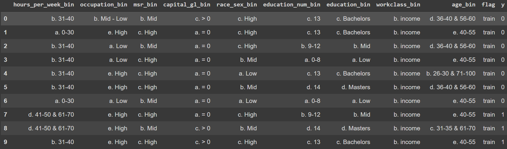

# 6070 CA03: Decision Tree Algorithm


## Objective
The objective of this case is to train a decision tree to predict if a individual's income would be above or below $50,000 based on some attributes about them such as their race, sex, education and work class etc. There are a total of 48842 records in this dataset.

## Data
The data is collected from the US Census Bureau's American Community Survey. All data has been divided into bins because the decision tree model is not able to be trained with continuous data. 
The data contains the following columns:
>hours_per_week_bin: Hours Worked per Week  <br>
>occupation_bin: Occupation Category <br>
>msr_bin:	Marriage Status & Relationships      <br>
>capital_gl_bin:  Capital Gain/Loss	      <br>
>race_sex_bin: Race-Sex Group	      <br>
>education_num_bin: Number of Years of Education	      <br>
>education_bin: Education Category  	      <br>
>workclass_bin: Work Class	      <br>
>age_bin: Age	      <br>
>flag: Train or Test	      <br>
>y: ('>50K' and '<=50K') [Labels: 1, 0]


## Tranforming the Data
To fit the decision tree we need to first transform the data from string categories into float categories. This is because the decision tree model cannot take strings as input. We use OrdinalEncoder from category_encoders to accomplish that. 
```ruby
import category_encoders as ce
encoder = ce.OrdinalEncoder(cols = x_cols)
X_train = encoder.fit_transform(X_train)
X_test = encoder.transform(X_test)
```
The following is the match of before and after:;
>hours_per_week_bin: Hours Worked per Week  <br>
>> 1: b. 31-40 <br>
>> 2: a. 0-30 <br>
>> 3: d. 41-50 & 61-70 <br>
>> 4: c. 71-100 <br>
>> 5: e. 51-60 <br>
>occupation_bin: Occupation Category <br>
>> 1: b. Mid - Low <br>
>> 2: e. High <br>
>> 3: a. Low <br>
>> 4: c. Mid - Mid <br>
>> 5: d. Mid - High <br>
>msr_bin:	Marriage Status & Relationships      <br>
>> 1: b. Mid <br>
>> 2: c. High <br>
>> 3: a. Low <br>
>capital_gl_bin:  Capital Gain/Loss	      <br>
>> 1: c. > 0 <br>
>> 2: a. = 0 <br>
>> 3: b. < 0 <br>
>race_sex_bin: Race-Sex Group	      <br>
>> 1: c. High <br>
>> 2: b. Mid <br>
>> 3: a. Low <br>
>education_num_bin: Number of Years of Education	      <br>
>> 1: c. 13 <br>
>> 2: b. 9-12 <br>
>> 3: a. 0-8 <br>
>> 4: d. 14 <br>
>> 5: e. 15+ <br>
>education_bin: Education Category <br>
>> 1: c. Bachelor <br>
>> 2: b. Mid <br>
>> 3: a. Low <br>
>> 4: d. Masters <br>
>> 5: e. High  	       <br>
>workclass_bin: Work Class	      <br>
>> 1: b. income <br>
>> 2: a. no income <br>
>age_bin: Age	      <br>
>> 1: d. 36-40 & 56-60 <br>
>> 2: e. 40-55 <br>
>> 3: b. 26-30 & 71-100 <br>
>> 4: c. 31-35 & 61-70 <br>
>> 5: a. 0-25 <br>

# Decision Tree
After the data is ready, we finally use it to fit the decision tree classifier. And we use graphviz to visualize the tree. 


# Tune Tree
After creating and visualize the decision tree, we use metrics including accuracy, precision, recall and F1 score to measure the perfomance of the tree, and use hyperparameters including Split Criteria, Minimum Sample Split, Minimum Sample Leaf and Maximum Depth to tune the decision tree. 

# Runtime
Without autotuning loop: ~2 minutes
With autotuning loop: 15-20 minutes
I used a second autotuning loop to test through a range of hyperparamter. It is slow because the number of iterations. An improvement would be to use a optimizer for such a test.
